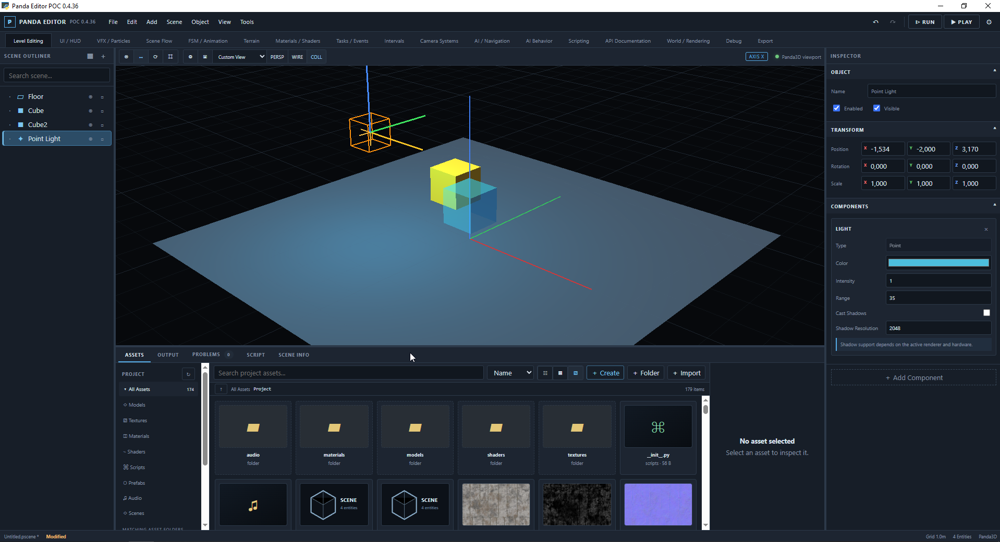
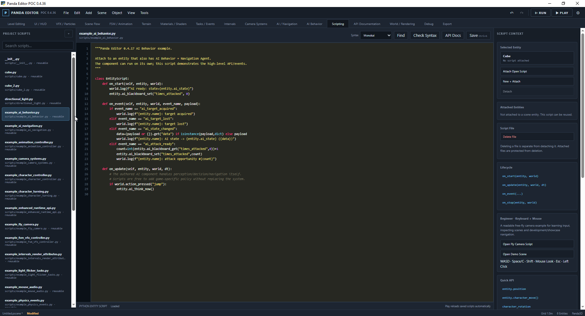
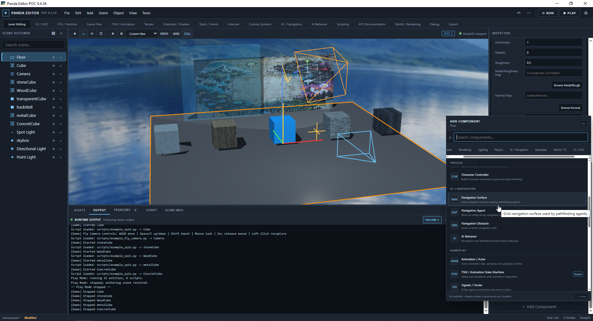
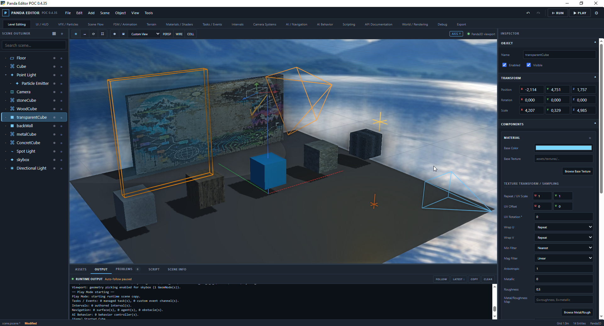
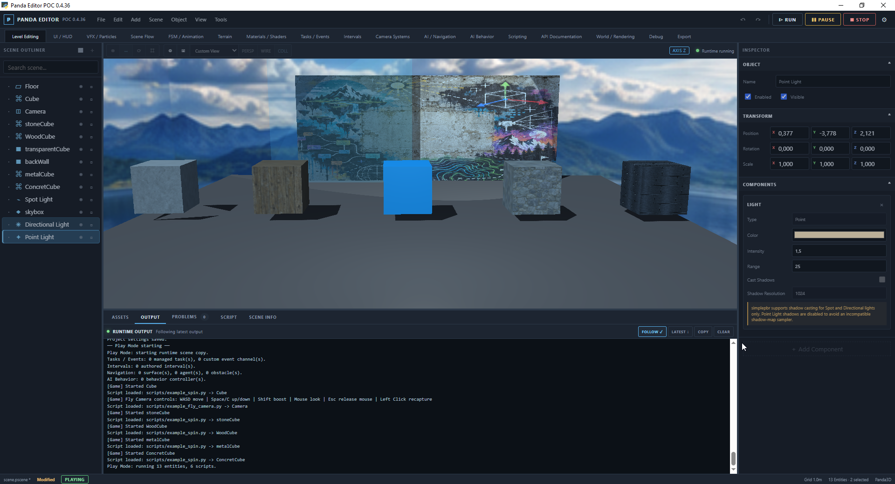
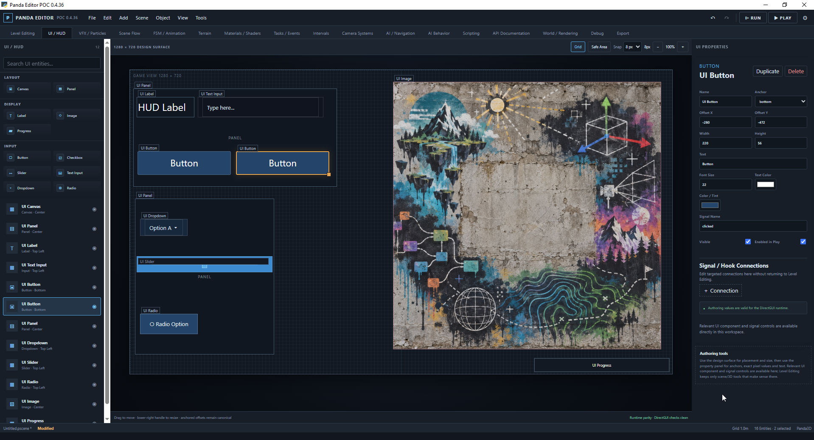
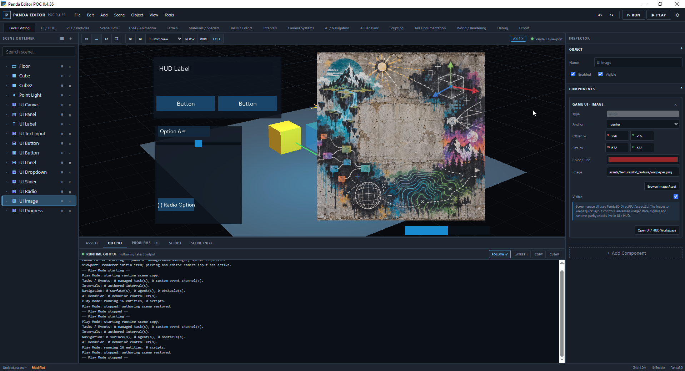
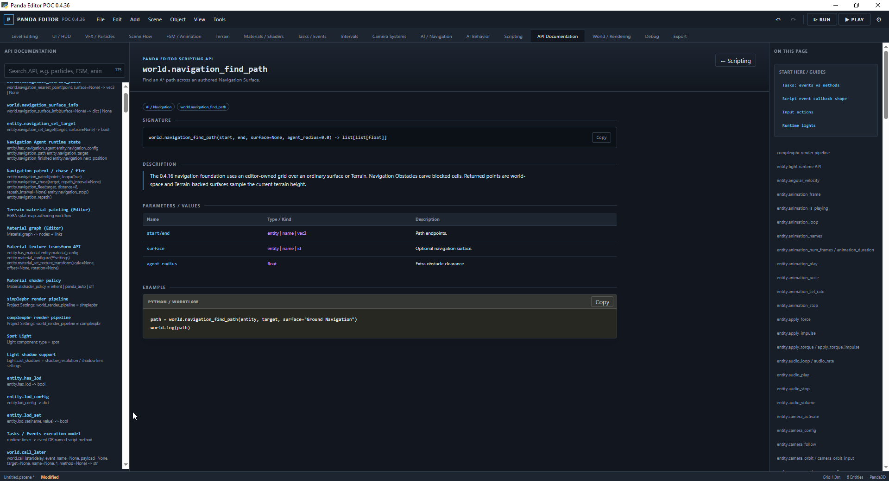
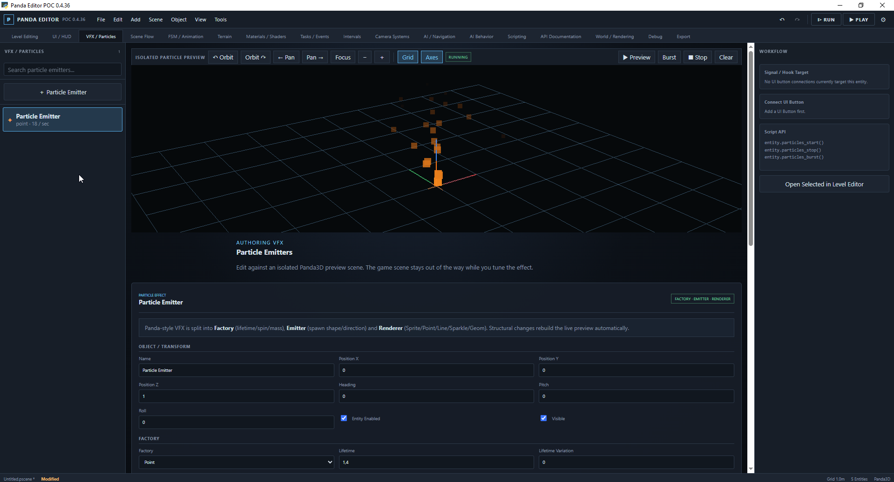
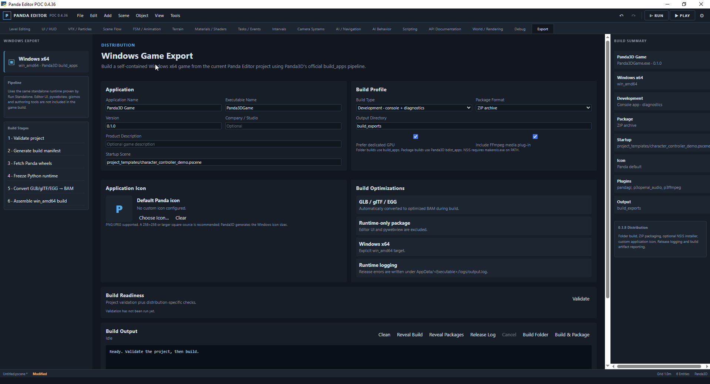

# Panda Editor POC 0.4.36

Panda Editor is a local Python/Panda3D scene, level and game-authoring proof of concept with a desktop editor UI built around **pywebview** and an embedded Panda3D viewport.

It is intended for experimenting with Panda3D workflows, learning, prototyping and building small game scenes without requiring every system to be authored directly in Python from scratch.

> **Project intent:** This is a personal, interest-driven project. The project is orchestrated and directed by its author: scope, design choices, testing, acceptance and iteration are author-driven. AI tools have been used extensively to assist with implementation, code generation, debugging, documentation and iteration.

This is a POC rather than a commercial engine or a replacement for Panda3D itself.

## Features at a glance

- Scene Outliner with hierarchy, grouping, multi-select, duplicate/delete/reparent and transform gizmos.
- Asset browser and project asset pickers for models, textures, audio, shaders and reusable materials.
- Materials/texturing with UV repeat, offset, rotation, filtering and PBR-oriented texture maps.
- Rendering profiles for Panda built-in rendering, `simplepbr` and optional `complexpbr` workflows.
- Point, Spot and Directional lights, shadows where supported, fog, skybox and post-processing controls.
- Terrain generation, sculpting and texture-layer painting.
- VFX/Particles with Factory / Emitter / Renderer authoring, including Sprite, Point, Line, Sparkle and Geom renderers.
- UI/HUD authoring with common DirectGUI-style controls and runtime events.
- Physics, colliders, rigid bodies and character controller support.
- Animation, FSM, Tasks / Events, Intervals, Signals and Render Attributes.
- Camera systems, navigation and AI Behavior authoring.
- In-editor Python scripting, runnable example scripts and searchable API Documentation.
- Play Mode, Output/Problems workflow, validation, project templates and standalone/export tooling.

For the full development history, see [`HISTORY_CHANGELOG.md`](HISTORY_CHANGELOG.md).

## Screenshots











## Requirements

Recommended development environment:

- **Windows 10/11**
- **Python 3.11+**
- A GPU/driver capable of running Panda3D/OpenGL
- Microsoft Edge WebView2 runtime for the pywebview UI on Windows

Python packages are defined in `requirements.txt` and currently include:

```text
pywebview==6.2.1
panda3d>=1.10.15
panda3d-gltf>=1.3.0
panda3d-simplepbr>=0.13.1
panda3d-complexpbr
```

`complexpbr` is the more demanding optional rendering path. The Panda built-in and `simplepbr` profiles are generally better starting points while developing/testing a project.

## Install and run

### Windows quick start

Extract or clone the project, then run:

```bat
setup_and_run.bat
```

This creates a local `venv`, installs `requirements.txt`, and launches the editor.

After the environment has been created, normal launches can use:

```bat
run.bat
```

### Manual setup

From the project folder:

```bat
py -3 -m venv venv
venv\Scripts\activate
python -m pip install -r requirements.txt
python run_editor.py
```

## Core editor controls

| Input | Action |
|---|---|
| Left Mouse | Select / interact with editor controls and scene objects |
| Middle Mouse | Orbit editor camera |
| Shift + Middle Mouse | Pan editor camera |
| Mouse Wheel | Zoom editor camera |
| `Q` | Select tool |
| `G` | Move tool |
| `R` | Rotate tool |
| `S` | Scale tool |
| `X` / `Y` / `Z` | Constrain active transform to an axis |
| `F` or `.` | Frame selected entity |
| `Home` | Frame all |
| `Delete` | Delete current selection |
| `Ctrl+D` | Duplicate current selection |
| `Ctrl+Z` | Undo |
| `Ctrl+Shift+Z` | Redo |
| `Ctrl+S` | Save scene |
| `Ctrl+O` | Open scene |
| `Ctrl+N` | New scene |
| `F6` | Play / Pause |
| `F8` | Stop Play Mode |

### Outliner multi-select

- `Ctrl` + click: toggle individual entities.
- `Shift` + click: select a visible range.
- `Ctrl` + `Shift` + click: add a range to the existing selection.

Game/runtime controls are project-defined through the Input Map. See `scripts/example_fly_camera.py` and `project_templates/fly_camera_showcase.pscene` for a simple keyboard + mouse example.

## Included project content

The repository intentionally includes default/reference content required by the examples and editor workflows:

```text
assets/
project_templates/
scripts/
ui/
```

Do **not** remove the shipped `assets/` directory when cloning, packaging or publishing the project. The `.gitignore` is intentionally written so default assets remain trackable.

## Useful entry points

```text
run_editor.py                  Editor entry point
run_game.py                    Standalone runtime entry point
project_settings.json          Project/runtime defaults
project_templates/             Runnable example scenes
scripts/                       Example EntityScript files
assets/                        Default textures/audio/materials/shaders
ui/                            pywebview editor frontend
engine/                        Panda3D editor/runtime implementation
bridge/                        Python ↔ editor UI API
scene/                         Scene document/entity serialization
runtime/                       Standalone runtime support
distribution/                  Editor build helpers
```

## Notes

- The editor is under active POC development; some advanced workflows remain experimental.
- Rendering support differs by active pipeline. For example, `simplepbr` supports Spot and Directional shadow casting but not Point Light shadow casting.
- The editor includes built-in project templates specifically for testing systems such as lighting/PBR, terrain, VFX, AI, navigation, physics, UI/HUD and scripting.
- API Documentation inside the editor is the preferred reference for runtime scripting methods and callback contracts.

## Attribution

Panda Editor is built on [Panda3D](https://www.panda3d.org/) and uses third-party Python packages listed in `requirements.txt`.

The editor/project code in this repository was developed through an author-directed, AI-assisted workflow.
